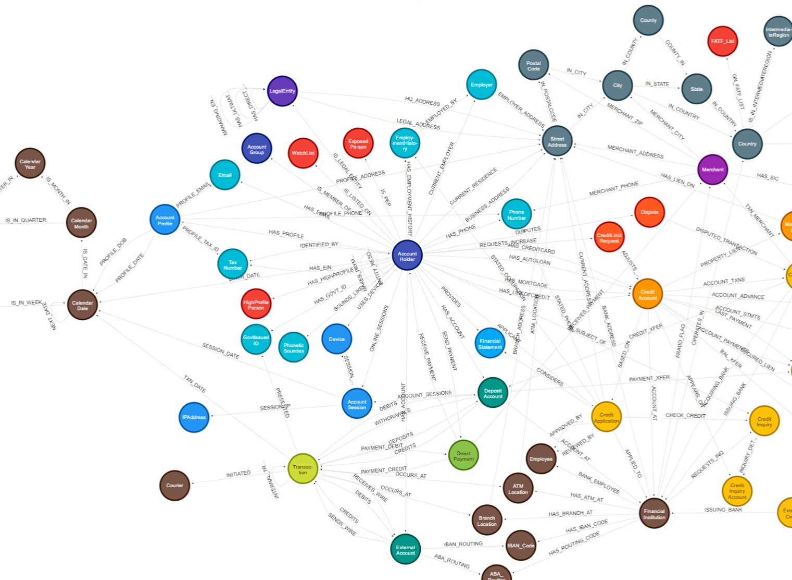
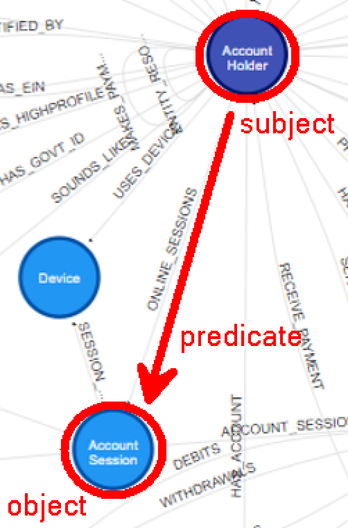

## Q1 - Knowledge Graph Query Processing

In a Knowledge Graph (KG), we represent data as `triples` in an inter-connected world.  
A *triple* is a 3-component tuple; they are known as: *subject* (*s*), *predicate* (*p*), and *object* (*o*).  
Q1 has the following classes:  
- `Triple`: Consists of a `subject`, `predicate`, and `object`. Represents a single fact/statement (triple) in the KG.
- Each `subject`, `predicate`, and `object` is a `TripleComponent` (with the corresponding `TripleComponentType`),
  and their "values" are simply represented by strings (the `value` field).  

Below there is a visualisation of a KG.



From the above KG, we can see three triples that has `Account Holder` as `subject`:  
```
	(Account Holder, HAS_PHONE      , Phone Number)
	(Account Holder, ONLINE_SESSIONS, Account Session)
	(Account Holder, HAS_ACCOUNT    , Deposit Account)
```  

The second triple is pictured below:  



Your task is to process **queries** that aim to retrieve specific components from a set of triples.
The Context-Free Grammar (CFG) for the given search queries is as follows.
```
  <QUERY>                  ->  <SELECT> <WHERE>
  <SELECT>                 ->  SELECT <TARGET>
  <TARGET>                 ->  ?subject | ?predicate | ?object | triple
  <WHERE>                  ->  WHERE { <CONDITION> }
  <CONDITION>              ->  <SUBJECT_INPUT> <PREDICATE_OBJECT_INPUT>
  <SUBJECT_INPUT>          ->  ?subject | <TARGET_VALUE>
  <PREDICATE_OBJECT_INPUT> ->  <PREDICATE_INPUT> <OBJECT_INPUT> | ε
  <PREDICATE_INPUT>        ->  ?predicate | <TARGET_VALUE>
  <OBJECT_INPUT>           ->  ?object | <TARGET_VALUE> | ε
```

***

<h2> Tasks </h2>

<h3> Part 1) Reading Triples </h3>

Complete `read` in the `TripleReader` class (`Q1a`). It reads an XML file based on the file path passed in, 
reads its content, and returns them as a Set of Triples.

- You may also find some basic tests in `Tests/TripleReaderTest.java`.
<br><br>

<h3> Part 2) Tokeniser </h3> 

Complete the methods for `Q1b` to `Q1d` within the `QueryTokenizer` class to perform a tokenisation process.
<br>
- The basic tests in `Tests/QTokenizerTest.java` could help with your code development.
- You may also read `getAllTokens()` in `QTokenizerTest` to understand the expected workflow of the `QueryTokenizer`.
- Note:
  - You do not need to consider the global validity of the query while tokenizing. (i.e. each token needs to be valid "individually" to not return null, but if the combination is wrong, e.g. WHERE { ?subject ?subject } you should still return the corresponding tokens accordingly)
<br><br>

<h3> Part 3) Search with a Parser </h3> 
The parser shall take in a tokenizer and process the tokens generated from it.

Further to the CFG,
- `<TARGET_VALUE>` can be any continuous string of characters that is at least one character long. It may include any uppercase or lower case letters, any digit (0-9), and the special characters including colon (:), forward slash (/), underscore (_), and fullstops (.).
- `ε` ("*epsilon*") represents the empty string. To clarify,it should NOT be considered a whitespace, and it (ε) does not need to be whitespace-separated with the other tokens.

In this CFG, `<QUERY>` is the **start variable**, and
the **terminals** include the literal values `?subject`, `?predicate`, `?object`, `triple`; `SELECT`, `WHERE`, `{`, and `}`.
<br><br>

Note that each token is separated by whitespaces. There will also be no whitespaces any of the triple components' `value` field.
- **Whitespaces** means a space (' '), newline ('\n' in linux), or tabs ('\t'), or a combination of them. 
- All literal values in the CFG/Search Query are `case-sensitive`.
<br><br>

Each `<CONDITION>` in the `<WHERE>` clause serve as a restriction on the search results, and the conditions are conjunctive (i.e., all must be fulfilled).
- If `<CONDITION>` is one of `?subject`, `?predicate`, or `?object`, then provide the `TripleComponentType` of the search token, and can be represented by a `QToken` of type `WHERE_ANY` (and shall not change the search results)
- Otherwise, its `TripleComponentType` should be induced by its position within the `<WHERE>` clause, and the corresponding `QTokenType` is `WHERE_MATCH` (You may see `I` in Example 2 of the tests for references).  
<br><br>

Complete the `parse` method (`Q1e`) within the `QueryParser` class.
- Some basic tests are in `Tests/QueryTest.java`, and there of the tests
- (noted as "Example 1, 2, 3" in the docString) may be helpful for your understanding of the basic syntax.
<br><br>

***

#### You are expected to update the following files and push them to GitLab:
* `QueryTokenizer.java`
* `QueryParser.java`
* `Triples/TripleReader.java`
