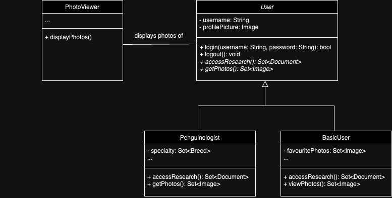
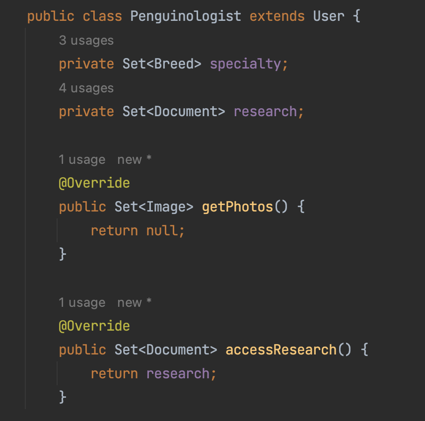

## Q3 - Code Quality and Refactoring

You are planning to develop an App about Penguins as a hobby project.
In order to build a prototype, you have gathered data from Kaggle, 
DBpedia, and by scraping posts and media from Instagram.

To get started, you planned to form the skeleton of the app and
build the basic parts of your App. In particular, you want to:

1. Read in data from local files for the App.
   The data include various types of information/content, and are in different forms.
   This includes files in JSON, XML, CSV, and Bespoke format.
2. Create two types of user accounts which fit the use case of different users 
  (`Penguinologist`, who want to see all the detailed information about the different species, and
   `Basic` users, who would appreciate a smooth user experience and mostly just want to see cute pictures of penguins rather than information.).

As a COMP2100/6442 student, you reckon, *Design Patterns* and *SOLID* are the way to go.

***

<h2>Task</h2>

**(Q3a)** Describe a good way to design the first feature. Specifically,
1. Give a general description about your ideas/design of the feature,
2. What design pattern(s) could be used
3. In what ways could this design pattern improve code quality?

**(Q3b)** Your peer have created a draft UML and some classes. Leaving in a hurry, he left a note,

> "Oops... Realized that my design violated a SOLID principle so seriously. Need your help."   
> </img>   
</img>
  

Judging from his UML (and an except of one of the classes)
1. Which SOLID principle has been violated?
2. Why and how it was violated (and explain why is this problematic)?
3. Explain how you could rectify this problem.
  
***

#### IMPORTANT NOTES:
- In your response, present your knowledge and understanding of the concepts and topics taught in the course.
- You will be assessed based on the quality and depth of your responses.
  This includes but is not limited to the conceptual understanding of the subject knowledge,
  correctness and preciseness of statements, and scope and variety of issues considered and tackled.
- Please clearly specify the question that you are addressing. You may also use headings and subheadings to better organize your response.
    
***

#### You are expected to update the following file and push them to GitLab:
* `Q3_answer.md`
